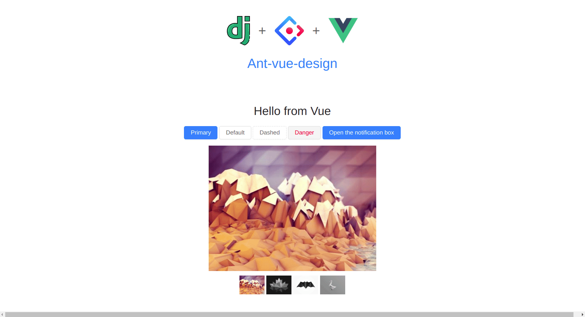

# django_vue

## Introduction
A quick example of ant-design Vue with django template using Django-Compressor-Parceljs
https://github.com/eadwinCode/django-compressor-parceljs

## Quick Start
For development: 

```docker-compose up --build```


For production:
 ```docker-compose -f docker-compose-prod.yml up --build```


## Preview


